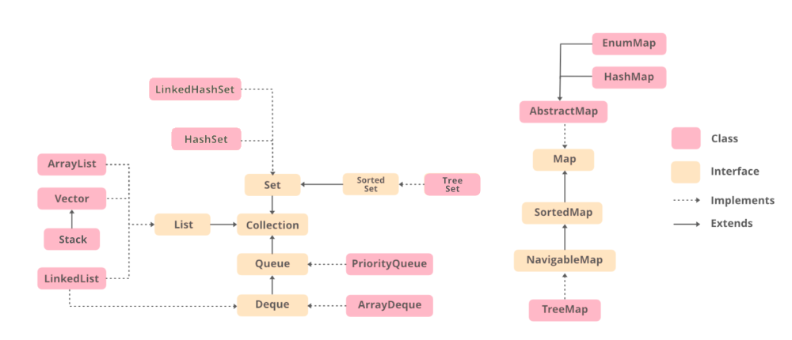

**Collection in Java**
The Collection in Java is a framework that provides an architecture to store and manipulate the group of objects.

Java Collection means a single unit of objects. Java Collection framework provides many interfaces (Set, List, Queue, Deque) and classes (ArrayList, Vector, LinkedList, PriorityQueue, HashSet, LinkedHashSet, TreeSet).



**Iterable Interface**
The Iterable interface is the root interface for all the collection classes. The Collection interface extends the Iterable interface and therefore all the subclasses of Collection interface also implement the Iterable interface.

It contains only one abstract method. i.e.,

Iterator<T> iterator()  
It returns the iterator over the elements of type T.

**Collection Interface**
The Collection interface is the interface which is implemented by all the classes in the collection framework. It declares the methods that every collection will have. In other words, we can say that the Collection interface builds the foundation on which the collection framework depends.

**_List Interface_**
List interface is the child interface of Collection interface. It inhibits a list type data structure in which we can store the ordered collection of objects. It can have duplicate values.

List interface is implemented by the classes ArrayList, LinkedList, Vector, and Stack.

To instantiate the List interface, we must use :

```
List <data-type> list1= new ArrayList();
```

**_ArrayList_**
The ArrayList class implements the List interface. It uses a dynamic array to store the duplicate element of different data types. The ArrayList class maintains the insertion order and is non-synchronized. The elements stored in the ArrayList class can be randomly accessed. The size of an ArrayList is increased automatically if the collection grows or shrinks if the objects are removed from the collection. Java ArrayList allows us to randomly access the list. ArrayList can not be used for primitive types, like int, char, etc. We will need a wrapper class for such cases. Consider the following example.

```
ArrayList<String> list=new ArrayList<String>();//Creating arraylist
```

**_LinkedList_**
LinkedList implements the Collection interface. It uses a doubly linked list internally to store the elements. It can store the duplicate elements. It maintains the insertion order and is not synchronized. In LinkedList, the manipulation is fast because no shifting is required. The elements are linked using pointers and addresses. Each element is known as a node.

```
LinkedList<String> al=new LinkedList<String>();
```

**_Vector_**
Vector uses a dynamic array to store the data elements. It is similar to ArrayList. However, It is synchronized and contains many methods that are not the part of Collection framework.

```
Vector<String> v=new Vector<String>();
```

**_Stack_**
The stack is the subclass of Vector. It implements the last-in-first-out data structure, i.e., Stack. The stack contains all of the methods of Vector class and also provides its methods like boolean push(), boolean peek(), boolean push(object o), which defines its properties.

```
Stack<String> stack = new Stack<String>();
```

**_Queue Interface_**
Queue interface maintains the first-in-first-out order. It can be defined as an ordered list that is used to hold the elements which are about to be processed. There are various classes like PriorityQueue, Deque, and ArrayDeque which implements the Queue interface.

Queue interface can be instantiated as:

```
Queue<String> q1 = new PriorityQueue();
Queue<String> q2 = new ArrayDeque();
```

**_PriorityQueue_**
The PriorityQueue class implements the Queue interface. It holds the elements or objects which are to be processed by their priorities. PriorityQueue doesn't allow null values to be stored in the queue.

```
PriorityQueue<String> queue=new PriorityQueue<String>();
```

**_Deque Interface_**
Deque interface extends the Queue interface. In Deque, we can remove and add the elements from both the side. Deque stands for a double-ended queue which enables us to perform the operations at both the ends.

Deque can be instantiated as:

```
Deque d = new ArrayDeque();
```

**_ArrayDeque_**
ArrayDeque class implements the Deque interface. It facilitates us to use the Deque. Unlike queue, we can add or delete the elements from both the ends.

ArrayDeque is faster than ArrayList and Stack and has no capacity restrictions.

```
Deque<String> deque = new ArrayDeque<String>();
```

**Set Interface**
Set Interface in Java is present in java.util package. It extends the Collection interface. It represents the unordered set of elements which doesn't allow us to store the duplicate items. We can store at most one null value in Set. Set is implemented by HashSet, LinkedHashSet, and TreeSet.

Set can be instantiated as:

```
Set<data-type> s1 = new HashSet<data-type>();
Set<data-type> s2 = new LinkedHashSet<data-type>();
Set<data-type> s3 = new TreeSet<data-type>();
```

**_HashSet_**
HashSet class implements Set Interface. It represents the collection that uses a hash table for storage. Hashing is used to store the elements in the HashSet. It contains unique items.

**_LinkedHashSet_**
LinkedHashSet class represents the LinkedList implementation of Set Interface. It extends the HashSet class and implements Set interface. Like HashSet, It also contains unique elements. It maintains the insertion order and permits null elements.

**_SortedSet Interface_**
SortedSet is the alternate of Set interface that provides a total ordering on its elements. The elements of the SortedSet are arranged in the increasing (ascending) order. The SortedSet provides the additional methods that inhibit the natural ordering of the elements.

The SortedSet can be instantiated as:

SortedSet<data-type> set = new TreeSet();

**_TreeSet_**
Java TreeSet class implements the Set interface that uses a tree for storage. Like HashSet, TreeSet also contains unique elements. However, the access and retrieval time of TreeSet is quite fast. The elements in TreeSet stored in ascending order.

_References:_
https://www.javatpoint.com/collections-in-java
https://www.geeksforgeeks.org/iterate-through-list-in-java/
https://www.geeksforgeeks.org/iterate-map-java/
https://www.geeksforgeeks.org/how-to-iterate-through-collection-objects-in-java/?ref=rp
