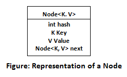
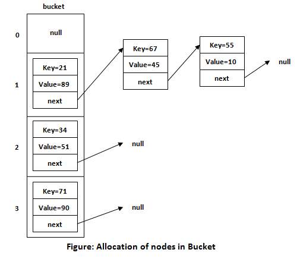

**_What is Hashing_**
It is the process of converting an object into an integer value. The integer value helps in indexing and faster searches.

What is HashMap
HashMap is a part of the Java collection framework. It uses a technique called Hashing. It implements the map interface. It stores the data in the pair of Key and Value. HashMap contains an array of the nodes, and the node is represented as a class. It uses an array and LinkedList data structure internally for storing Key and Value. There are four fields in HashMap.

Before understanding the internal working of HashMap, you must be aware of hashCode() and equals() method.

**_equals():_** It checks the equality of two objects. It compares the Key, whether they are equal or not. It is a method of the Object class. It can be overridden. If you override the equals() method, then it is mandatory to override the hashCode() method.
**_hashCode():_** This is the method of the object class. It returns the memory reference of the object in integer form. The value received from the method is used as the bucket number. The bucket number is the address of the element inside the map. Hash code of null Key is 0.
**_Buckets:_** Array of the node is called buckets. Each node has a data structure like a LinkedList. More than one node can share the same bucket. It may be different in capacity.

**_Hash Collision_**
This is the case when the calculated index value is the same for two or more Keys. Let's calculate the hash code for another Key "Sunny." Suppose the hash code for "Sunny" is 63281940. To store the Key in the memory, we have to calculate index by using the index formula.

https://www.javatpoint.com/working-of-hashmap-in-java
