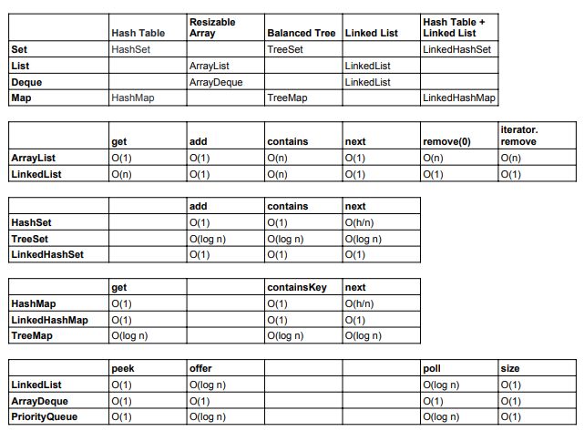
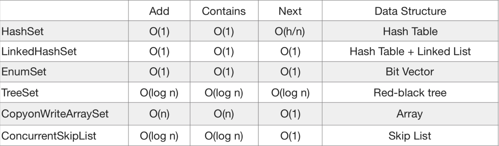
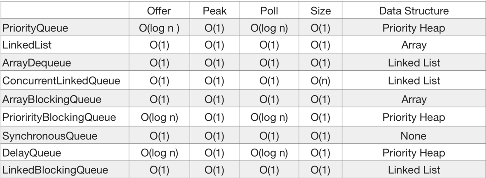
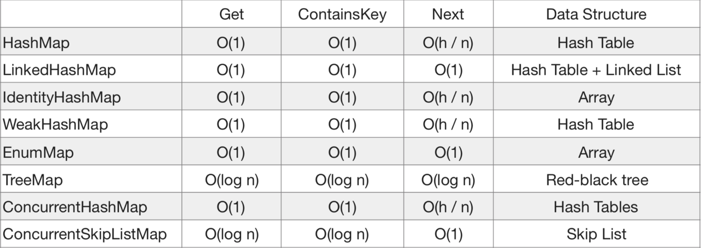

## Time Complexity

Usually, when we talk about time complexity, we refer to Big-O notation. Simply put, the notation describes how the time to perform the algorithm grows with the input size.

**1. List**
Let's start with a simple list, which is an ordered collection.

Here we'll look at a performance overview of the ArrayList, LinkedList, and CopyOnWriteArrayList implementations.

**_1.1. ArrayList_**
The ArrayList in Java is backed by an array. This helps to understand the internal logic of its implementation. A more comprehensive guide for the ArrayList is available in this article.

So let's focus first on the time complexity of the common operations at a high level:

**_add()_** – takes O(1) ti me; however, worst-case scenario, when a new array has to be created and all the elements copied to it, it's O(n)
**_add(index, element)_** – on average runs in O(n) time
**_get()_** – is always a constant time O(1) operation
**_remove()_** – runs in linear O(n) time. We have to iterate the entire array to find the element qualifying for removal.
**_indexOf()_** – also runs in linear time. It iterates through the internal array and checks each element one by one, so the time complexity for this operation always requires O(n) time.
**_contains()_** – implementation is based on indexOf(), so it'll also run in O(n) time.

**_1.2. CopyOnWriteArrayList_**
This implementation of the List interface is beneficial when working with multi-threaded applications. It's thread-safe.

Here's the Big-O notation performance overview for CopyOnWriteArrayList:
**_add()_** – depends on the position we add value, so the complexity is O(n)
**_get()_** – is O(1) constant time operation
**_remove()_** – takes O(n) time
**_contains()_** – likewise, the complexity is O(n)
As we can see, using this collection is very expensive because of the performance characteristics of the add() method.

**1.3. LinkedList**
LinkedList is a linear data structure that consists of nodes holding a data field and a reference to another node. For more LinkedList features and capabilities.

Let's present the average estimate of time we need to perform some basic operations:

**_add()_** – appends an element to the end of the list. It only updates a tail, and therefore, it's O(1) constant-time complexity.
**_add(index, element)_** – on average runs in O(n) time
**_get()_** – searching for an element takes O(n) time.
**_remove(element)_**– to remove an element, we first need to find it. This operation is O(n).
**_remove(index)_** – to remove an element by index, we first need to follow the links from the beginning; therefore, the overall complexity is O(n).
**_contains()_** – also has O(n) time complexity

**_Time:_**
Insertion — O(1),Search — O(n).​Deletion — O(1),Indexing — O(n),
**_Space_**
O(n)

**2. Set**
Generally, Set is a collection of unique elements. Here we're going to examine the HashSet, LinkedHashSet, EnumSet, TreeSet, CopyOnWriteArraySet, and ConcurrentSkipListSet implementations of the Set interface.

Hashset is implemented using a hash table. elements are not ordered. the add, remove, and contains methods has constant time complexity o(1).

Treeset is implemented using a tree structure(red-black tree in algorithm book). the elements in a set are sorted, but the add, remove, and contains methods has time complexity of o(log (n)). it offers several methods to deal with the ordered set like first(), last(), headset(), tailset(), etc.

Linkedhashset is between hashset and treeset. it is implemented as a hash table with a linked list running through it, so it provides the order of insertion. the time complexity of basic methods is o(1).

Now let's jump ahead to present the time complexity numbers. For HashSet, LinkedHashSet, and EnumSet, the add(), remove() and contains() operations cost constant O(1) time thanks to the internal HashMap implementation.

Likewise, the TreeSet has O(log(n)) time complexity for the operations listed in the previous group. This is because of the TreeMap implementation. The time complexity for ConcurrentSkipListSet is also O(log(n)) time, as it's based in skip list data structure.

For CopyOnWriteArraySet, the add(), remove() and contains() methods have O(n) average time complexity.

**3. Queue**

**_Priority Deque_**

**_time_**

Java Priority Queue is implemented using Heap Data Structures and Heap has O(log(n)) time complexity to insert and delete element.
Offer() and add() methods are used to insert the element in the in the priority queue java program.
Poll() and remove() is used to delete the element from the queue.
Element retrieval methods i.e. peek() and element(), that are used to retrieve elements from the head of the queue is constant time i.e. O(1).
contains(Object)method that is used to check if a particular element is present in the queue, have leaner time complexity i.e. O(n).

**_Array Deque_**
**_time_**

In a doubly-linked list implementation and assuming no allocation/deallocation overhead, the time complexity of all deque operations is O(1). Additionally, the time complexity of insertion or deletion in the middle, given an iterator, is O(1); however, the time complexity of random access by index is O(n).

**4. Map**

**_LinkedHashMap_**
**time**

LinkedHashMap — uses a Hash table as its underlying data structure and preserves insertion order.

**_get()_** — retrieving takes O(1) constant-time
containsKey() — searching for an element takes O(1) time
**_next()_** — fetching an element takes O(1) time.

**_IdentityHashMap_**
IdentityHashMap — uses a Hash table as its underlying data structure.

**_get()_** — retrieving takes O(1) constant-time
**_containsKey()_** — searching for an element takes O(1) time
**_next()_** — fetching an element takes O(h/n) time, where ‘h’ is table capacity.

**_TreeMap:_**
Java TreeMap class is a red-black tree based implementation. It provides an efficient means of storing key-value pairs in sorted order.

**_get()_** — retrieving takes O(log n) constant-time.
**_containsKey()_** — searching for an element takes O(log n) time.
**_next()_** — fetching each element takes O(log n) time.

_References:_
https://www.baeldung.com/java-collections-complexity
https://yogeshkkhichi.medium.com/time-and-space-complexity-of-collections-5a00c7b1d32b
